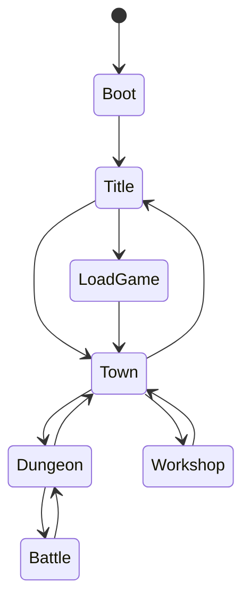

# 03 架构设计

## 3.1 分层结构

```
scripts/
├── autoload/              # 单例（Godot Autoload）
│   ├── game_database.gd
│   ├── game_session.gd
│   ├── save_manager.gd
│   ├── scene_flow.gd
│   └── event_bus.gd       # 或用 Signal 集中站
├── core/
├── domain/                # 纯逻辑，尽量不依赖 Node
│   ├── character/
│   ├── item/
│   ├── skill/
│   ├── dungeon/
│   ├── battle/
│   └── chant/             # 咏唱代价结算
├── gameplay/
│   ├── dungeon_exploration/
│   ├── battle/
│   ├── town/
│   ├── workshop/          # 整备模块/刻印
│   └── dialogue/
├── presentation/
│   ├── dungeon_view/
│   ├── battle_ui/
│   ├── town_ui/
│   └── representation_ui/
└── editor/                # @tool CSV 导入
    └── csv_importer/
```

**依赖规则**：`presentation → gameplay → domain → core`；`domain` 不 `extends Node`（用 `RefCounted`）。

## 3.2 Autoload 单例

| 名称 | 职责 | 场景树 |
|------|------|--------|
| `GameDatabase` | 配置表索引 | Autoload |
| `GameSession` | 队伍、背包、flag、模块、刻印、代价债务 | Autoload |
| `SaveManager` | JSON 存档 | Autoload |
| `SceneFlow` | 场景切换、加载层 | Autoload |
| `EventBus` | 全局信号 | Autoload |
| `Localization` | `tr(key)` | Autoload |
| `AudioManager` | BGM/SE | Autoload 或场景常驻 |

`project.godot` 中注册上述 Autoload。

## 3.3 游戏状态（顶层 FSM）



实现：`game_state_machine.gd`（`RefCounted` 或挂在 `SceneFlow`）。

| 状态 | 场景 | 说明 |
|------|------|------|
| Boot | `scenes/boot/boot.tscn` | 载入配置 |
| Title | `scenes/title/title.tscn` | 主菜单 |
| Town | `scenes/town/fratsiats.tscn` | 城镇 |
| Dungeon | `scenes/dungeon/dungeon.tscn` | 迷宫 + 战斗 Overlay |
| Workshop | `ui/town/guild_workshop.tscn` | 整备（可嵌在 Town） |

## 3.4 模块职责

### DungeonExploration

- `dungeon_controller.gd`：输入 → `DungeonGrid.try_move`  
- `encounter_controller.gd`：遇敌 → Battle  
- `dungeon_zone_controller.gd`：wild/safe 切换、灯光预设  

### Battle

- `battle_state_machine.gd`：含 `CHANTING` 状态  
- `turn_resolver.gd`：速度、伤害、弱点连携  
- `chant_resolver.gd`：读条、代价写入 `GameSession.chant_debts`  

### Workshop

- `module_service.gd`：研发 Main App 式模块  
- `chant_service.gd`：装备/解锁刻印  

### Representation

- `representation_panel.gd`：只读 `GameSession` + `GameDatabase`  

## 3.5 信号（EventBus）

```gdscript
signal dungeon_moved(pos: Vector2i, facing: int)
signal encounter_triggered(pool_id: String)
signal battle_ended(result: Dictionary)
signal chant_debt_applied(debt: Dictionary)
signal module_unlocked(module_id: String)
signal story_flag_set(flag: String)
```

UI 与音频 `connect`，避免 Controller 互引。

## 3.6 场景列表

| 场景 | 路径 |
|------|------|
| Boot | `scenes/boot/boot.tscn` |
| Title | `scenes/title/title.tscn` |
| Town | `scenes/town/fratsiats.tscn` |
| Dungeon | `scenes/dungeon/dungeon.tscn` |

战斗：`dungeon.tscn` 子节点 `BattleOverlay`（`CanvasLayer` layer=10）。

## 3.7 测试策略

| 类型 | 工具 | 范围 |
|------|------|------|
| 单元 | GUT 或 Godot 内置 test | `CombatFormula`、`DungeonGrid`、`ChantCost` |
| 集成 | 场景手动 / `@tool` 跑图 | 进迷宫 → 咏唱战 |
| 配置 | Editor 菜单 | CSV id 引用完整性 |

## 3.8 编码规范（摘要）

- 类型标注：`func foo(x: int) -> bool`  
- 配置 id：`String`，禁止魔法数字  
- 日志：`push_warning` / 自定义 `GameLog`  
- 文件命名：`snake_case.gd`，类名 `PascalCase`  

---

## 版本记录

| 版本 | 日期 | 说明 |
|------|------|------|
| 0.1 | 2026-07-02 | Unity 版 |
| 1.0 | 2026-07-03 | Godot Autoload + 咏唱/整备模块 |
