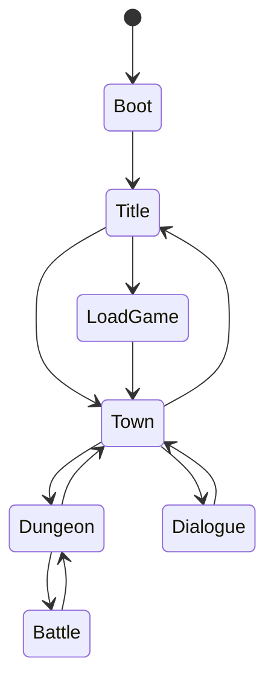
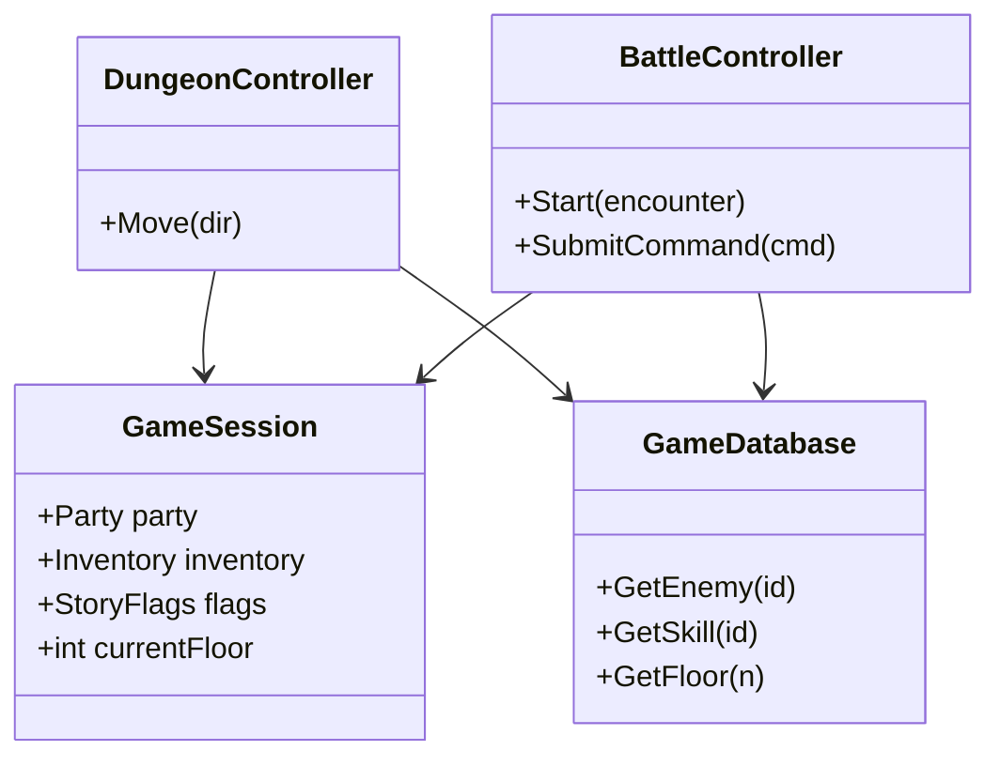

# 03 架构设计

## 3.1 分层结构

```
Assets/_Project/Scripts/
├── Core/                 # 基础设施
│   ├── EventBus/
│   ├── Save/
│   ├── Config/
│   └── SceneFlow/
├── Domain/               # 纯数据与规则
│   ├── Character/
│   ├── Item/
│   ├── Skill/
│   ├── Dungeon/
│   └── Battle/
├── Gameplay/             # 用例 / 控制器
│   ├── DungeonExploration/
│   ├── Battle/
│   ├── Town/
│   └── Dialogue/
├── Presentation/         # 视图、UI、音频
│   ├── DungeonView/
│   ├── BattleUI/
│   ├── TownUI/
│   └── RepresentationUI/   # 「表示」面板
└── Editor/               # 导入器、校验
    ├── CsvImporter/
    └── MapEditor/
```

**依赖规则**：`Presentation → Gameplay → Domain → Core`，禁止 Domain 引用 UnityEngine（除 Vector 等可用包装）。

## 3.2 核心单例与生命周期

| 服务 | 职责 | 生命周期 |
|------|------|----------|
| `GameDatabase` | 所有配置表运行时索引 | DontDestroyOnLoad |
| `GameSession` | 当前队伍、背包、flag、层进度 | DontDestroyOnLoad |
| `SaveManager` | 序列化/反序列化 | DontDestroyOnLoad |
| `SceneFlow` | 场景切换、加载屏 | DontDestroyOnLoad |
| `EventBus` | 解耦事件 | 静态或单例 |

## 3.3 游戏状态（顶层 FSM）



| 状态 | Scene | 说明 |
|------|-------|------|
| Boot | Boot | 加载配置、初始化服务 |
| Title | Title | 主菜单 |
| Town | Town_Fratsiats | 城镇设施 |
| Dungeon | Dungeon | 迷宫探索 |
| Battle | （叠加或独立） | 回合战斗 |
| Dialogue | Overlay | 任意状态可叠加 |

实现：`GameStateMachine` + `IGameState` 接口，每个状态负责 Enter/Exit/Tick。

## 3.4 模块职责

### DungeonExploration

- `DungeonController`：接收输入，调用 `IDungeonGrid.TryMove`  
- `EncounterController`：遇敌判定，切 Battle  
- `DungeonEventController`：踩事件格，触发 `Dialogue` 或 `Quest`  

### Battle

- `BattleController`：回合流程  
- `TurnResolver`：速度排序、行动结算  
- `AIController`：读 `EnemyAI.csv`  

### Town

- `TownController`：设施入口  
- `ShopService` / `InnService` / `HospitalService`  

### Representation（特色）

- `RepresentationService`：对玩家展示 Status/Skill/Inventory  
- 读 `GameSession` + `GameDatabase`，只读  

## 3.5 事件总线（推荐事件）

```csharp
// 示例事件名
DungeonMovedEvent
EncounterTriggeredEvent
BattleEndedEvent
ItemObtainedEvent
LevelUpReadyEvent
StoryFlagSetEvent
SaveRequestedEvent
```

UI 与音频订阅事件，避免 Controller 互相引用。

## 3.6 场景列表

| Scene | 路径 |
|-------|------|
| Boot | `Scenes/Boot.unity` |
| Title | `Scenes/Title.unity` |
| Town_Fratsiats | `Scenes/Town_Fratsiats.unity` |
| Dungeon | `Scenes/Dungeon.unity` |

战斗首期不单独建 Scene，使用 `Dungeon` + `BattleOverlay` Prefab。

## 3.7 关键类图（简化）



## 3.8 测试策略

| 类型 | 工具 | 范围 |
|------|------|------|
| 单元测试 | Unity Test Framework | Domain 伤害公式、格点移动 |
| 集成测试 | Play Mode Test | 从进迷宫到遇敌 |
| 配置校验 | Editor 菜单 | CSV id 引用完整性 |

## 3.9 编码规范（摘要）

- 命名：`PascalCase` 类型，`_camelCase` 私有字段  
- 配置 id 一律 `string`，禁止魔法数字  
- 异步加载必须带 `CancellationToken` 或场景卸载保护  
- 日志：`UnityEngine.Debug` 封装为 `GameLog`，发布版可关  
