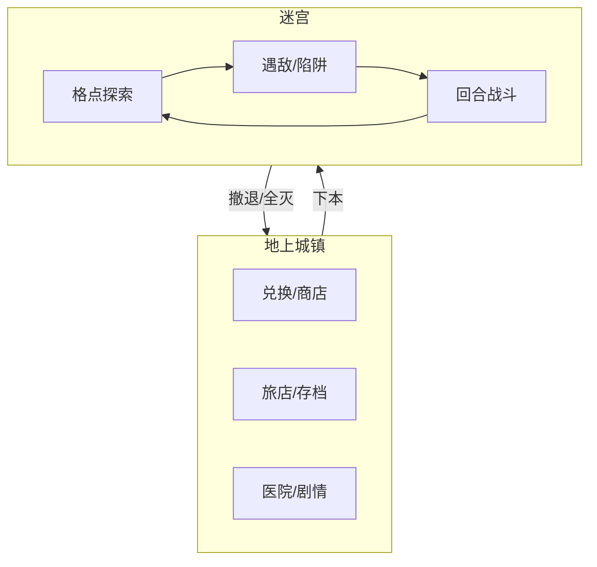

# 02 核心体验与循环

## 2.1 DRPG 是什么

**DRPG**（Dungeon RPG / 迷宫 RPG）源于日本对 **Wizardry** 一脉作品的统称，核心特征：

| 维度 | DRPG 典型表现 |
|------|---------------|
| 视角 | 第一人称，走廊式前进 |
| 移动 | 网格（格点），90° 转向，一格一步 |
| 战斗 | 回合制，前后排站位，指令选择 |
| 队伍 | 多角色编成（前卫/后卫/治疗） |
| 地图 | 多层固定或半固定迷宫，楼梯连接 |
| 节奏 | 慢、算计、资源管理、死亡/撤退压力大 |

与 ARPG（即时动作）、纯 Roguelike（常全随机单局）的区别：DRPG 强调 **固定迷宫结构下的最优解** 与 **回城整备循环**，而非操作反应或单局 Build。



## 2.2 本作核心循环

```
【准备】城里购买补给、分配技能点、编成队伍、触发剧情
    ↓
【下本】选择目标层数，沿正道/岔路探索
    ↓
【探索】遇敌、开宝箱、踩事件格；消耗 HP/MP/道具
    ↓
【判定】MP/补给是否支撑继续深入？
    ├─ 是 → 向更深层/目标点推进
    └─ 否 → 沿正道撤退
    ↓
【战斗】回合指令：攻击/技能/道具/防御/逃跑
    ↓
【收获】经验、魔石、掉落、剧情 flag
    ↓
【回城】贩卖、治疗、存档、解锁新设施/队友
    ↓
（循环直至层 Boss / 守护者战或章节节点）
```

## 2.3 玩家情感曲线（对标第一卷）

| 阶段 | 体验 | 对应剧情 |
|------|------|----------|
| 迷失 | 不懂规则、濒死、技能？？？发动 | 第一章开篇 |
| 掌握 | 学会表示、持有物品、Dimension 索敌 | 第一章中后期 |
| 安心 | 正道、兑换所、图书馆情报 | 第二章 |
| 成长 | 与缇亚组队、刷级、资源规划 | 第三章 |
| 挫折 | Boss 级敌人越层出现、缇亚断手 | 第四章 |
| 悬念 | 混乱累积、守护者真相 | 第五章 |

## 2.4 会话时长设计

| 场景 | 目标时长 |
|------|----------|
| 新手教程（管理领域外→正道→出口） | 15～25 分钟 |
| 单次探索（早期 1～3 层往返） | 20～40 分钟 |
| 单层完整清图 | 30～60 分钟 |
| 层 Boss / 守护者战 | 30～60 分钟（可存档前） |
| 地上剧情+整备 | 10～20 分钟 |
| 垂直切片一周目 | 8～15 小时 |

## 2.5 难度与失败设计

- **早期**：管理领域外高死亡率，教会「勿轻信他人」  
- **中期**：毒/出血等状态异常，教会「带对解毒药」  
- **Boss 战**：允许撤退；全灭损失为「本次下本收获的部分」或「金钱惩罚」，避免纯删档  
- **存档点**：城内随时存档；迷宫内仅正道休息点 / 层间楼梯（可配置）

## 2.6 与第二卷的循环扩展（后续里程碑）

- 据点（租房）替代纯旅店  
- 多人编成：佣兵、学院考试队事件  
- 祭典期间城内 UI 与商店变化  
- 阿尔缇同行时的「信任度」与分头行动  
