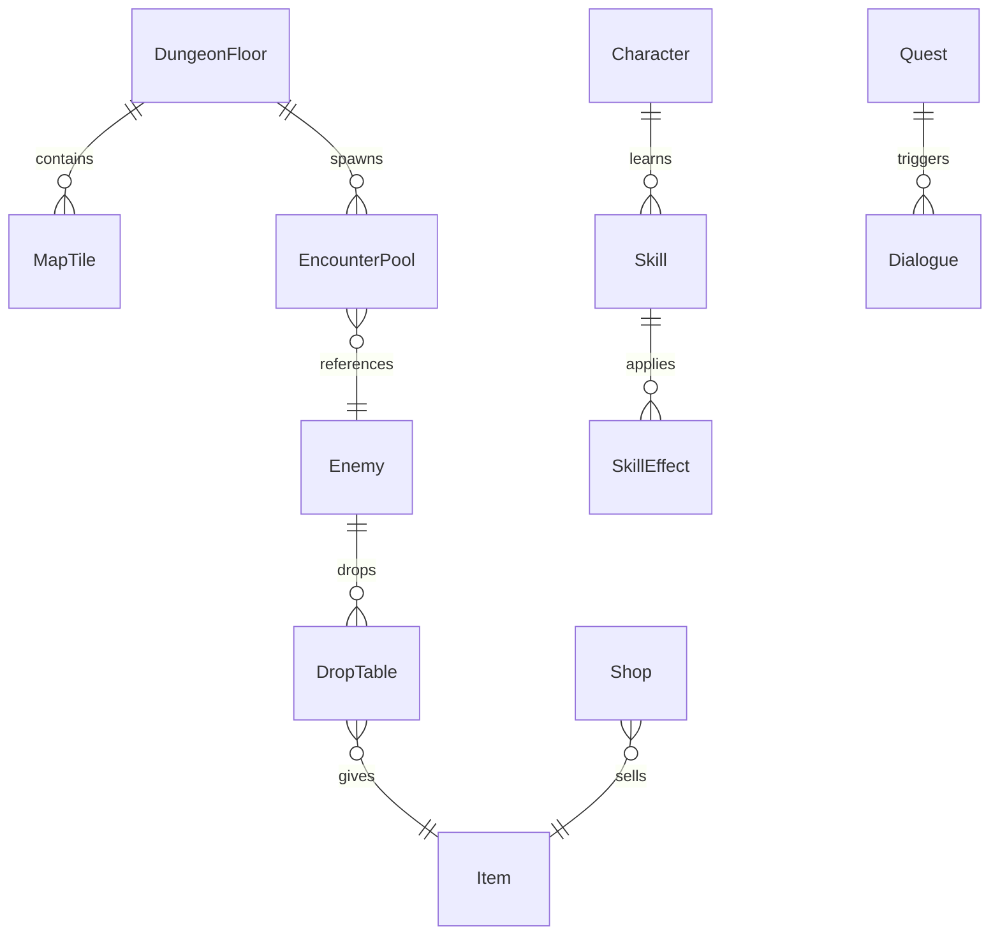

# 07 配置表设计

> 数据驱动：玩法数值 **禁止写死在 C#**，统一由配置表 + ScriptableObject 或 JSON 加载。  
> 工作流建议：**Excel / Google Sheet 编辑 → 导出 CSV → Unity 导入**。

## 7.1 表清单

| 表名 | 文件名 | 说明 |
|------|--------|------|
| 角色 | `Character.csv` | 基础属性、成长 |
| 等级经验 | `LevelExp.csv` | 升级所需经验 |
| 敌人 | `Enemy.csv` | 怪物属性 |
| 技能 | `Skill.csv` | 技能定义 |
| 技能效果 | `SkillEffect.csv` | 伤害/Buff 公式参数 |
| 物品 | `Item.csv` | 装备与消耗品 |
| 掉落 | `DropTable.csv` | 掉落池 |
| 迷宫层 | `DungeonFloor.csv` | 层元数据 |
| 地图格 | `MapTile.csv` | 格子类型与事件 |
| 遇敌 | `EncounterPool.csv` | 权重遇敌 |
| 商店 | `Shop.csv` | 商品 |
| AI | `EnemyAI.csv` | 敌人行为 |
| 对话 | `Dialogue.csv` | 剧情文本 |
| 任务 | `Quest.csv` | 任务 flag |
| 公式常数 | `GameConst.csv` | 全局常数 |
| 本地化 | `Localization.csv` | 多语言 key |

样例文件见：[samples/](./samples/)

## 7.2 ID 命名规范

| 前缀 | 含义 | 示例 |
|------|------|------|
| `chr_` | 角色 | `chr_aikawa` |
| `en_` | 敌人 | `en_blackfly` |
| `sk_` | 技能 | `sk_ice` |
| `it_` | 物品 | `it_antidote_bee` |
| `df_` | 迷宫层 | `df_01` |
| `map_` | 地图 | `map_01_01` |
| `dlg_` | 对话 | `dlg_st001_01` |
| `q_` | 任务 | `q_tia_join` |

## 7.3 表关系



## 7.4 核心表字段定义

### Character.csv

| 字段 | 类型 | 说明 |
|------|------|------|
| id | string | 主键 |
| name_key | string | 本地化 key |
| base_hp | int | |
| base_mp | int | |
| str,vit,dex,agi,int,mag | float | 六维 |
| growth_id | string | 成长曲线 |
| innate_skills | string | 逗号分隔 skill id |
| portrait | string | 资源路径 |
| battle_icon | string | |

### Enemy.csv

| 字段 | 类型 | 说明 |
|------|------|------|
| id | string | |
| name_key | string | |
| rank | int | 位阶 |
| hp,atk,def,agi | int | |
| weak_elem | string | fire,ice,... |
| resist_elem | string | |
| exp | int | |
| drop_id | string | |
| ai_id | string | |
| battle_image | string | |

### Skill.csv

| 字段 | 类型 | 说明 |
|------|------|------|
| id | string | |
| name_key | string | |
| type | enum | Physical/Magic/Support |
| mp_cost | int | |
| target | enum | Self/Single/Row/All |
| effect_id | string | |
| max_level | int | |
| point_per_level | int | |

### Item.csv

| 字段 | 类型 | 说明 |
|------|------|------|
| id | string | |
| name_key | string | |
| item_type | enum | Consumable/Equip/Material/Key |
| equip_slot | string | Weapon/Body/... |
| atk,def | int | 装备加成 |
| use_effect_id | string | 消耗品效果 |
| poison_cure_tag | string | 解毒类型标签 |
| buy_price,sell_price | int | |
| stack_max | int | |

### DungeonFloor.csv

| 字段 | 类型 | 说明 |
|------|------|------|
| id | string | df_01 |
| floor_number | int | 1 |
| map_id | string | |
| theme | string | stone |
| is_safe_zone | bool | 是否管理领域内 |
| encounter_pool_id | string | |
| boss_id | string | 可空 |
| bgm_id | string | |

### MapTile.csv

| 字段 | 类型 | 说明 |
|------|------|------|
| map_id | string | |
| x,y | int | 格坐标 |
| tile_type | enum | Wall/Floor/Door/StairsUp/StairsDown/Event |
| event_id | string | |
| wall_variant | int | 第一人称贴图变体 |

### Dialogue.csv

| 字段 | 类型 | 说明 |
|------|------|------|
| id | string | |
| speaker | string | chr id 或 Narrator |
| text_key | string | |
| next_id | string | |
| choice_a_id,choice_b_id | string | 可空 |
| set_flag | string | 触发 flag |

## 7.5 公式（GameConst + 代码）

建议在 `GameConst.csv` 存常数，公式在 `CombatFormula` 单类：

```
physical_damage = atk * skill_rate * (100 / (100 + def))
magic_damage = mag * skill_rate * element_mod
exp_to_next = base_exp * Pow(level, exp_power)
```

## 7.6 策划工作流

1. 在 `samples/` 复制模板表  
2. 策划只改 CSV / Sheet，不直接改 Unity 场景里的怪数值  
3. CI 或 Editor 菜单「重新导入配置」  
4. 校验脚本：检查 id 引用是否存在、掉落率之和等  

## 7.7 与 Unity 的对应

见技术方案：`ScriptableObject` 存档运行时数据，`CSV` 或 `Google Sheets` 为源。  
详细实现 → `../技术方案选型/04-数据与配置方案.md`
