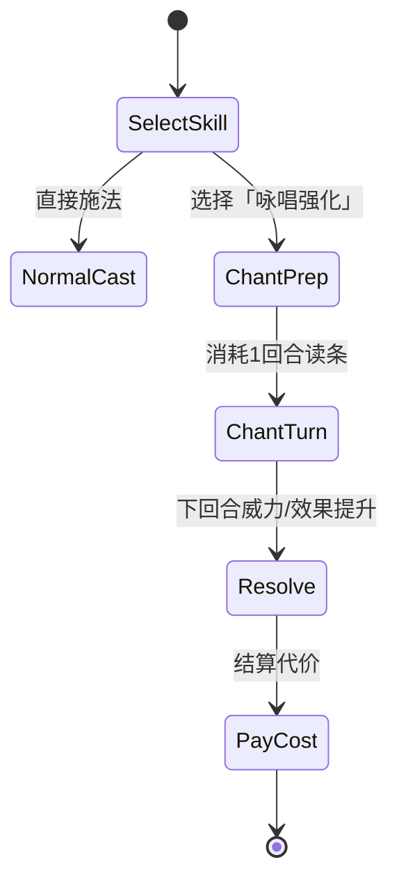

# 11 咏唱·咒术与整备系统

> **原著依据**：文库第二卷 192 话《咒术『咏唱』》；第一卷召唤/正道/冰结战；后期卷「理的盗窃者」人生咏唱（垂直切片仅作远期伏笔）。  
> **玩法参考**：[10-奇异之旅拆解](./10-真女神转生奇异之旅拆解.md) — Main App / SubApp / 实验室整备循环。  
> **引擎实现**：见 [02-Godot引擎方案](../技术方案选型/02-Godot引擎方案.md)。

---

## 11.1 原著机制摘要（策划必读）

### 咒术 vs 魔法

| 概念 | 说明 | 游戏化 |
|------|------|--------|
| **魔法** | 术式镌刻在血中；想象 + 可选咒语辅助 | 常规技能，消耗 MP |
| **咒术** | 以「牺牲」换力量，与魔法互为表里 | 咏唱系统底层 |
| **咏唱** | 咒术的一种；将诗句/人生向「世界」宣告以支付代价 | 强化魔法或解锁特殊效果 |

罗德（192 话）原话要点：

1. 「将用咒术增强魔法的力量美化之后才冠以了『咏唱』这个名字。」  
2. 一般人无意识掌握咒术基础；需另学 **咒术式**（非魔术式）。  
3. **Level UP** 本质是咒术：以 **毒** 为代价换取升级（教会颂祷含升级咏唱）。  
4. 一般代价 = **与咏唱所花时间相等的时间**；危险度↑则额外失去 **次日应回复的魔力与体力**。  
5. 更严重则按 **属性** 征收心灵代价（见下表）。  
6. 涡波模仿炎蛇咏唱时「每吐一字心中重要之物丧失」——故战后拒再用火属性深咏唱。

### 属性代价表（垂直切片可玩 subset）

| 属性 | 轻度咏唱（可练） | 重度咏唱（剧情/Boss） | 游戏效果（切片） |
|------|------------------|----------------------|------------------|
| **风** | 「天路垂临」「续道碧霄」— 情绪略飘，很快恢复 | 罗德示范长诗 — 永久高昂（无法再恢复） | 轻：本战魔法威力 +15%，战后无 debuff；重：**混乱 -1** 但威力 ×2（NPC 专用） |
| **火** | — | 燃烧内心重要记忆 | 轻：不开放；重：威力极大，**永久损失 1 条被动槽**（缇达战后事件解锁叙事） |
| **水** | — | 内心冰冷 | 冰结咏唱：Freeze 必中，战后 **好感对话选项减少 1**（临时 3 场战斗） |
| **次元** | 涡波偏科，风咒文失败 | 人生/空间类大咒 | Dimension 索敌范围 ×3，代价：**本层无法再自然回复 MP** |
| **无属性** | — | 丧失新鲜感（480 话） | 不纳入切片 |

### 「人生咏唱」（远期 / Boss 层）

- 404 话：透过 **魔石** 吟唱 **盗窃者的人生** 为代价，向世界引魔力。  
- 垂直切片 **仅 UI 预告**（图书馆词条）， playable 在 P2 守护者战做 **单段 QTE 咏唱**。

---

## 11.2 与奇异之旅的系统融合

将 SJ 的「探索能力模块化」与原著「咏唱代价」合并为 **双层成长**：

```
迷宫带回魔石/素材
  → 弗茨亚茨「兑换所 + 公会整备所」（= Red Sprite 实验室）
      → 【整备模块】用魔石研发（类似 Main App）
      → 【咒术刻印】用稀有魔石解锁咏唱段（类似 SubApp，但有代价）
  → 下本时携带有限「刻印槽」
```

### 11.2.1 整备模块（Main App 映射）

| 模块 id | 名称 | 解锁条件 | 功能 | SJ 对照 |
|---------|------|----------|------|---------|
| `mod_enemy_sense` | 敌感知 | 初始 | 罗盘：前方 3 格敌意提示 | Enemy Appearance |
| `mod_dimension_map` | 次元测绘 | 3 层 + 魔石×10 | 小地图揭示 +2 格；与 Dimension 技能叠乘 | Columbus 弱化 |
| `mod_safe_path` | 正道感知 | 进入正道事件后 | 管理领域格高亮；撤退线标注 | —（原著独有） |
| `mod_trap_warn` | 陷阱预警 | 5 层 + 稀有魔石 | 陷阱格进入前图标闪烁 | Omen Bug |
| `mod_poison_id` | 毒鉴别 | 中毒事件后 | 注视怪物显示毒种标签 | — |
| `mod_foe_lantern` | 位阶明灯 | 5 层 Boss 后 | 明雷强敌在小地图显示 | Enemy Search A |

### 11.2.2 咒术刻印（SubApp + 咏唱映射）

| 刻印 id | 咏唱诗句（示例） | 效果 | 代价（每场战斗） |
|---------|------------------|------|------------------|
| `chant_wind_light` | 天路垂临 / 续道碧霄 | 风/冰技能 MP -20% | 战后 30 秒内移动速度 -10%（「时间」代价） |
| `chant_ice_oath` | 霜凝吾念 / 封彼狂怒 | Freeze 先制 +1 回合 | 下一天（回城休息前）MP 上限 -15% |
| `chant_dimension_scan` | 界门洞开 / 索敌千里 | Dimension 本层全图脉冲 1 次 | 本层自然 MP 回复 = 0 |
| `chant_sword_flash` | 致亲爱的一闪（诺文线 P2） | 剑术必暴击 1 次 | 损失次日体力回复 |

**槽位规则（切片）**：

- 2 个刻印槽；Expert 难度仅 1 槽。  
- 刻印与模块 **不冲突**，但同属性刻印不可叠装。  
- 战斗中发动咏唱 = **额外消耗 1 回合**（咏唱回合不可防御），对应 DRPG「读条」风险。

### 11.2.3 弱点连携（Co-Op 弱化版）

| 条件 | 效果 |
|------|------|
| 击中弱点或 Freeze 碎冰 | 同排另一角色 **追击 1 次**（50% 伤害） |
| 缇亚入队 + `chant_ice_oath` 激活 | 追击改为冰属性且可碎冰 |
| Expert+ | 追击不消耗回合，但敌人先制率 +10% |

---

## 11.3 战斗内咏唱流程



| 步骤 | 玩家体验 | 数据 |
|------|----------|------|
| 1 | 技能菜单出现「咏唱」副选项（已装刻印且 MP 足够） | `skill.allow_chant`, `chant_id` |
| 2 | 咏唱回合：播放诗句字幕 + 简 SE；敌人照常行动 | `BattleState.Chanting` |
| 3 | 次回合自动施法或同回合若「无咏唱」被动 | `chant_multiplier` |
| 4 | 战后写入 `GameSession.chant_debts[]` | 持续时间/层数 |

**与「表示」UI 联动**：咏唱读条时仍可使用「注视」查看敌人，但不可打开技能分配页。

---

## 11.4 难度与咏唱（接 SJ 10.9）

| 难度 | 咏唱威力倍率 | 代价倍率 | 备注 |
|------|--------------|----------|------|
| 叙事 | ×1.3 | ×0.5 | 教程正道内 |
| 标准 | ×1.0 | ×1.0 | 默认 |
| 硬核 | ×1.2 | ×1.5 | 管理领域外推荐 |
| 挑战 | ×1.0 | ×2.0 | 咏唱失败（被打断）额外混乱 +0.5 |

咏唱被打断：前卫受伤或混乱 ≥ 3 时，读条失败，**仍支付一半代价**。

---

## 11.5 配置表扩展

### Chant.csv（新增）

```
id,element,name_key,verse_key,skill_tag,effect_type,effect_value,cost_type,cost_value,duration
chant_wind_light,Wind,chant_wind_name,chant_wind_verse,Ice|Wind,mp_cost_mult,0.8,move_speed,0.9,30
chant_dimension_scan,Dimension,chant_dim_name,chant_dim_verse,Dimension,map_pulse,1,mp_regen_floor,0,1
```

### UpgradeModule.csv（新增）

```
id,name_key,unlock_floor,unlock_item_id,cost_mstone,effect_script
mod_dimension_map,mod_dim_map_name,3,,10,res://scripts/modules/dimension_map.gd
```

### GameSession 追加字段

```json
"installed_modules": ["mod_enemy_sense", "mod_safe_path"],
"installed_chants": ["chant_wind_light"],
"chant_debts": [{ "id": "mp_regen_floor", "floors_left": 1 }]
```

---

## 11.6 垂直切片范围

| 纳入 | 不纳入 |
|------|--------|
| `chant_wind_light`、`chant_ice_oath` 两条 | 人生咏唱 playable |
| 模块 `mod_enemy_sense`、`mod_safe_path`、`mod_poison_id` | 全 15 模块 |
| 冰结组合教学关（洒水 + Freeze + 可选咏唱） | 火属性深咏唱 |
| 图书馆词条解释咒术 | 理的盗窃者魔石线 |

---

## 11.7 验收标准

- [ ] 装备风之刻印后，冰结技能可走咏唱读条，MP 消耗降低  
- [ ] 咏唱回合敌人可攻击，打断则付半代价  
- [ ] 次元扫描刻印使用后，本层休息无法回 MP  
- [ ] 兑换所可花魔石研发 `mod_poison_id`  
- [ ] 难度「叙事」下代价减半且教程有说明  

---

## 版本记录

| 版本 | 日期 | 说明 |
|------|------|------|
| 0.1 | 2026-07-03 | 初版：咏唱代价 + SJ 整备融合 |
